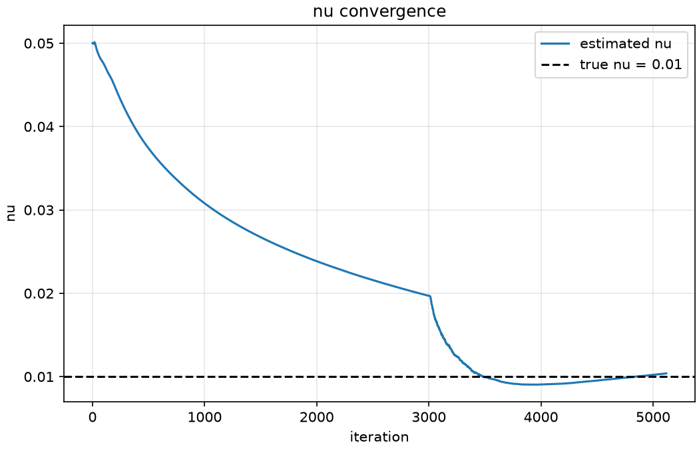
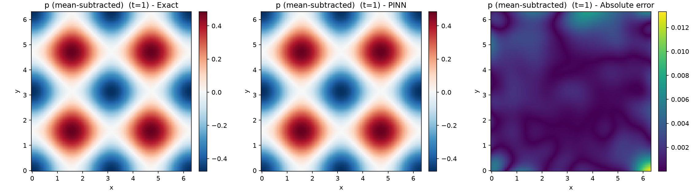
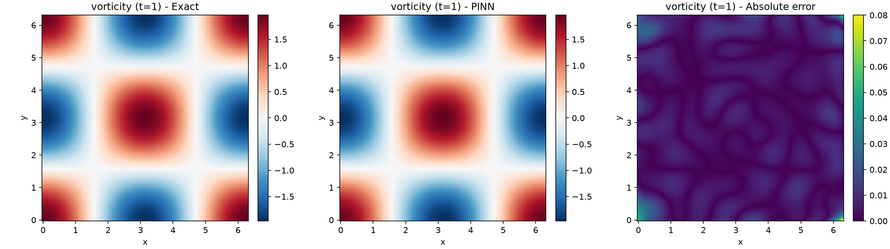
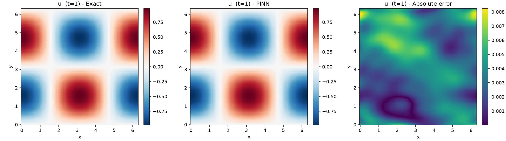

# Hidden Fluid Mechanics — a 2D Navier–Stokes PINN (forward + inverse)

This is my final project for SoC PID 32. I build a Physics-Informed Neural Network
(PINN) for the 2D incompressible Navier–Stokes equations and use it for two things:

1. a **forward solve** — validating the physics engine against an exact analytical
   flow, and
2. an **inverse reconstruction** — the headline — where, from nothing but **sparse,
   noisy velocity samples**, the network recovers the **full velocity field**, the
   **pressure field it never saw**, and the **unknown viscosity `ν`**.

The inverse problem is the interesting one: pressure is never provided as data, yet
it falls out of the physics, and a single unknown physical constant is identified from
noisy measurements. This is the classic "hidden fluid mechanics" idea.

## Results

**Inverse reconstruction** (4000 scattered velocity samples, 3% Gaussian noise,
pressure hidden, `ν` started 5× off at 0.05):

| Quantity | Result |
| --- | --- |
| Recovered viscosity `ν` | **0.0104** vs true **0.01** — within **3.9%** |
| Velocity relative L2 (u) | **0.42%** |
| Velocity relative L2 (v) | **0.42%** |
| Pressure relative L2 (never measured, mean-subtracted) | **1.61%** |

**Forward validation** on the Taylor–Green vortex (mean relative L2 over three time
slices): **0.74%** (u), **0.90%** (v), **3.58%** (p, mean-subtracted).

### The viscosity is identified from noisy data

Starting from a deliberately wrong value, Adam drifts `ν` down and the L-BFGS
fine-tune snaps it onto the true value:



### The pressure field is recovered without ever being measured

Only velocity was given to the network. The pressure below comes purely from the
momentum equations:



### Vorticity stays clean even as a derived quantity

Vorticity `ω = v_x − u_y` involves derivatives of the reconstructed field, so it is a
good stress test of the solution's smoothness:



## How it works

- **Governing equations.** 2D incompressible Navier–Stokes (two momentum equations
  plus continuity), non-dimensional.
- **Stream-function formulation.** The network outputs `(ψ, p)` and I recover velocity
  as `u = ψ_y`, `v = −ψ_x`. This makes continuity `u_x + v_y ≡ 0` hold *exactly* by
  construction (verified numerically at ~1e-9), so it never has to be enforced as a
  loss — one fewer term to balance and a big stability win.
- **Autodiff residuals.** All spatial and temporal derivatives in the PDE residual are
  computed with `torch.autograd.grad(..., create_graph=True)`.
- **Two-stage optimization.** Adam (with a plateau LR scheduler) does the bulk of the
  work, then a full-batch L-BFGS fine-tune squeezes out the final accuracy — this is
  also where `ν` locks onto its true value.
- **Inverse setup.** `ν` is a single learnable parameter kept positive via a softplus.
  The loss is a data misfit on the sparse noisy `(u, v)` plus the PDE residual at
  collocation points — no pressure term, no boundary/initial conditions. Because the
  Taylor–Green decay rate is `exp(−2νt)`, the measurements span several time slices so
  that `ν` is identifiable from velocity alone.
- **Pressure gauge.** Incompressible pressure is only defined up to an additive
  constant, so I subtract the per-slice spatial mean from both the predicted and true
  pressure before computing any pressure error.

## Validating the engine first (Taylor–Green vortex)

Before the inverse problem I validated the residual code on the Taylor–Green vortex,
an exact solution of Navier–Stokes, training purely on physics (initial condition +
periodic boundaries + PDE residual, no interior labels). Predicted and exact velocity
fields are visually identical:



## Layout

```
Week4/
├── src/            # library code
│   ├── config.py       # domain, hyperparameters, seeds, paths
│   ├── data.py         # analytical fields, sampling, noisy measurements
│   ├── pde.py          # autodiff derivatives, NS residuals, stream-function head
│   ├── model.py        # tanh MLP with input normalization
│   ├── train.py        # Adam -> L-BFGS loops (forward and inverse)
│   ├── inverse.py      # learnable viscosity + inverse loss/metrics
│   ├── viz.py          # field/error/vorticity/curve plots
│   └── utils.py        # seeding, device, relative-L2
├── notebooks/
│   ├── 01_forward_validation.ipynb
│   └── 02_inverse_reconstruction.ipynb
├── run_forward.py      # reproduces the forward validation
├── run_inverse.py      # reproduces the inverse reconstruction
├── THEORY.md           # the maths: equations, stream function, inverse setup
└── results/            # figures + metrics.json
```

## Reproducing

```
python -m venv .venv
.venv\Scripts\activate
pip install -r Week4/requirements.txt   # install the CUDA torch wheel first (see the file)
cd Week4
python run_forward.py     # Taylor-Green forward validation
python run_inverse.py     # inverse reconstruction (recovers nu, u, v, p)
```

Seeds are fixed throughout; the numbers above are written to `results/metrics.json`.
